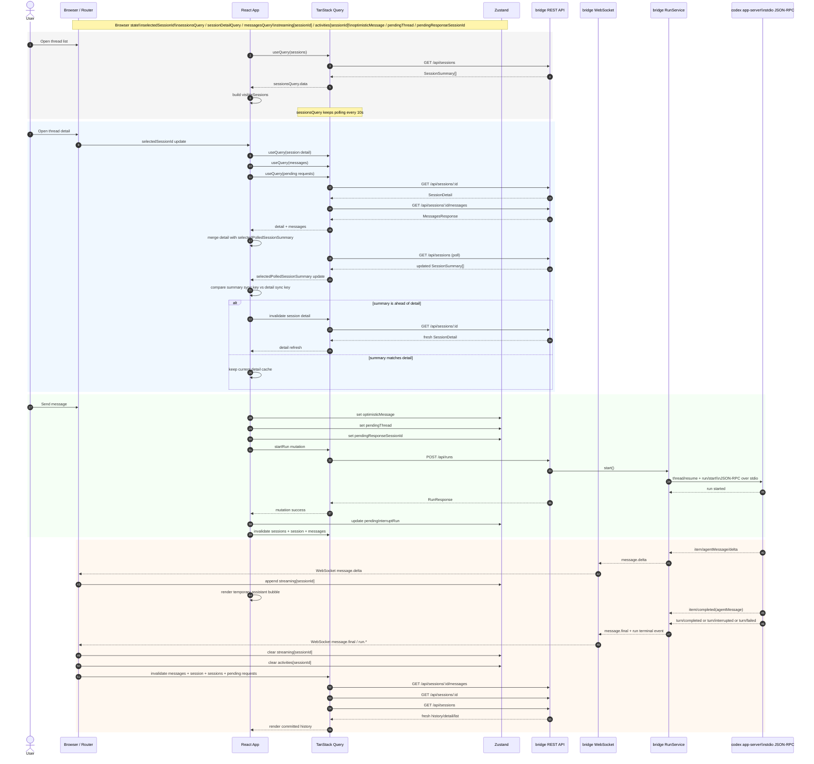

# Session List / Detail Sync Sequence

このメモは、一覧 poll に連動して selected session の detail を background refetch する現在の挙動を前提にしたシーケンス整理です。

## Scope

- Thread list を開く
- Thread detail を開く
- Message を送信する
- Assistant message が終わる

`messages` query の細かい改善はまだ含めません。ここでは current behavior を固定します。

## Components

- Browser / Router
- React App
- TanStack Query
- Zustand
- `bridge` REST API
- `bridge` WebSocket
- `bridge` `RunService`
- `codex app-server`

## Protocol Boundaries

- Browser -> `bridge`: HTTP REST
- Browser <-> `bridge`: WebSocket
- `bridge` <-> `codex app-server`: JSON-RPC over stdio

## Browser State

- Route state
  - `selectedSessionId`
- Query state
  - `sessionsQuery`
  - `sessionDetailQuery`
  - `messagesQuery`
  - `pendingCodexRequestsQuery`
- UI store state
  - `streaming[sessionId]`
  - `activities[sessionId]`
  - `optimisticMessage`
  - `pendingThread`
  - `pendingResponseSessionId`
  - `pendingInterruptRun`

## Notes

- `sessionsQuery` は viewport や selected thread の有無に関係なく有効で、10 秒 interval で poll します。
- mobile で detail を開いている間も、thread list の更新は裏で走ります。
- selected session の polled summary が loaded detail より先に進んだら、`sessionDetailQuery` を background refetch します。
- `message.delta` は正式履歴ではなく、一時的に `streaming[sessionId]` に蓄積して表示します。
- `message.final` 後に `messagesQuery` と `sessionDetailQuery` を invalidate して、正式履歴へ置き換えます。

## Sequence

