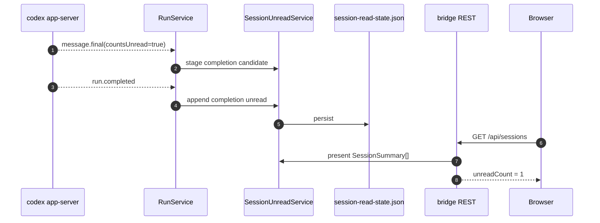
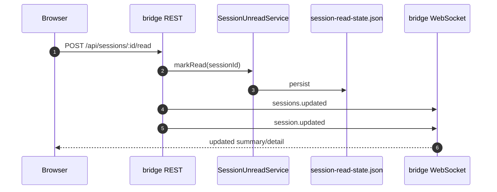

# Session Unread State Design

このドキュメントは、thread 一覧 / detail 同期の既存フローに合わせて、
session unread state をどう生成・保存・配信するかを整理する。

前提となる既存フローは
[`docs/session-list-detail-sync-sequence.md`](./session-list-detail-sync-sequence.md)
を参照する。

## Goals

- 過去 thread を初回表示しただけで unread にしない
- thread の live completion / error だけを unread に昇格する
- unread を session status と同じく `bridge` 側の overlay state として扱う
- browser refresh / bridge restart 後も未読を維持する
- list poll と detail fetch の既存整合フローに自然に乗る

## Non-goals

- `codex app-server` の thread snapshot から historical unread を推定すること
- bridge 停止中に完了した thread を restart 後に unread として backfill すること
- V1 で multi-tab / multi-device の active viewer presence を厳密に取ること

## Constraints

- current `thread/read` snapshot には read receipt / read cursor はない
- live bridge event には `message.final.countsUnread` がある
- session 一覧は 10 秒 poll、detail/messages は selected session のみ fetch される
- `RunService` はすでに session status を local overlay として導出している

## Design Summary

- unread の source of truth は `bridge` の `SessionUnreadService`
- unread の保存先は `DATA_DIR/session-read-state.json`
- unread の生成契機は live terminal event のみ
- unread の表示値は `catalog` の snapshot に対する present-time overlay として付与する
- 既読化は `POST /api/sessions/:sessionId/read` で行う

## Data Model

保存モデルは session 単位の event cursor と unread queue を持つ。

```ts
type StoredUnreadState = {
  version: 1;
  sessions: Record<string, {
    lastEventSeq: number;
    lastReadEventSeq: number;
    unread: Array<{
      seq: number;
      kind: "completion" | "error";
      turnId: string;
      runId?: string;
      createdAt: string;
    }>;
    updatedAt: string;
  }>;
};
```

### Why This Shape

- `lastEventSeq`
  - session 内で bridge が live に観測した unread-capable terminal event の単調増加 cursor
- `lastReadEventSeq`
  - ユーザーが既読化した位置
- `unread[]`
  - 現在の unread badge / filter / icon を直接導出するための最小集合

このモデルだと、`SessionSummary` の既存フィールド

- `unreadCount`
- `lastEventSeq`
- `lastReadEventSeq`
- `hasUnreadCompletion`
- `hasUnreadError`

を lossless に埋められる。

## Event Rules

### 1. `message.final`

- `countsUnread = false`
  - unread 候補にしない
- `countsUnread = true`
  - その turn を `completion pending` として一時保持する
  - この時点では unread を増やさない

理由:

- commentary や途中の assistant output を unread として数えたくない
- unread は terminal turn として確定した時点でのみ立てる

### 2. `run.completed`

- 同一 turn に `completion pending` があれば
  - unread entry `kind = "completion"` を append
- pending がなければ
  - unread を増やさない

理由:

- live event を観測できなかった historical completion を unread にしないため

### 3. `run.error`

- `kind = "error"` unread を append
- 同一 turn の pending completion は捨てる

### 4. `run.interrupted`

- V1 では unread を立てない
- 同一 turn の pending completion は捨てる

## Persistence Rules

- unread state は event 処理時と mark-read 時に即時 persist する
- persist は tmp file + rename の atomic write とする
- state file 不在時は空 state で起動する
- parse failure 時は warn 相当の fallback ではなく空 state で続行する

## Presenter Integration

既存の session state 導出は次の順で行う。

1. `catalog`
   - `thread/list` / `thread/read` snapshot から base `SessionSummary` / `SessionDetail` を作る
2. `RunService`
   - local active/latest run を使って status を overlay する
3. `SessionUnreadService`
   - persisted unread state を overlay する
4. `app.ts`
   - pending request count を overlay する

つまり unread は status と同じく
"snapshot そのもの" ではなく "bridge-owned projection" として扱う。

## Read Trigger

既読化は「selected になった瞬間」ではなく、以下を満たした時だけ行う。

- real session である
- current route の `selectedSessionId` と一致する
- `sessionDetailQuery` が success
- `messagesQuery` が success
- page が visible
- window が focused
- mobile の場合は chat pane が前面にある
- `unreadCount > 0`
- 条件成立後に短い debounce を置く

理由:

- background tab のまま既読化しない
- detail / messages 未取得の状態で既読化しない
- mobile で sidebar 側にいるだけの状態を既読とみなさない

## Detail Sync

既存の `sessionDetailSyncKey()` は polled summary が detail より先に進んだ時に
detail refetch を起こす。

unread を list/detail 一貫で見せるため、sync key に以下を加える。

- `unreadCount`
- `lastEventSeq`
- `lastReadEventSeq`
- `hasUnreadCompletion`
- `hasUnreadError`

これにより、unread overlay だけが変わったケースでも detail 側が自然に追従する。

## Lifecycle

### Browser open with old completed threads

- `GET /api/sessions`
- `catalog` が completed session を返す
- unread state に live-generated entry がなければ unread は 0
- 過去 thread は unread にならない

### New assistant completion while thread is not being read

- `message.final(countsUnread=true)` を live で観測
- `completion pending` を stage
- `run.completed` を観測
- unread entry を append
- `sessionsQuery` / `sessionDetailQuery` が refetch される
- list/detail に unread が表示される

### User opens the thread and reads it

- detail/messages load
- page visible + focused
- debounce 後に `POST /api/sessions/:id/read`
- `lastReadEventSeq = lastEventSeq`
- unread queue を空にする
- `sessions.updated` / `session.updated` を broadcast

## Sequences





## Trade-offs

- bridge 停止中に完了した thread は unread にしない
  - これは欠点だが、historical completion を勝手に unread 化しないことを優先する
- V1 では foreground viewer presence を共有しない
  - 同一 session を別 tab で開いていると、片方が read API を叩くまで unread は残る

## Future Extensions

- WebSocket `session.read` を primary path に寄せる
- active viewer presence を持ち、foreground viewer がいる session では unread 生成を抑制する
- interruption unread の扱いを UX で再検討する
