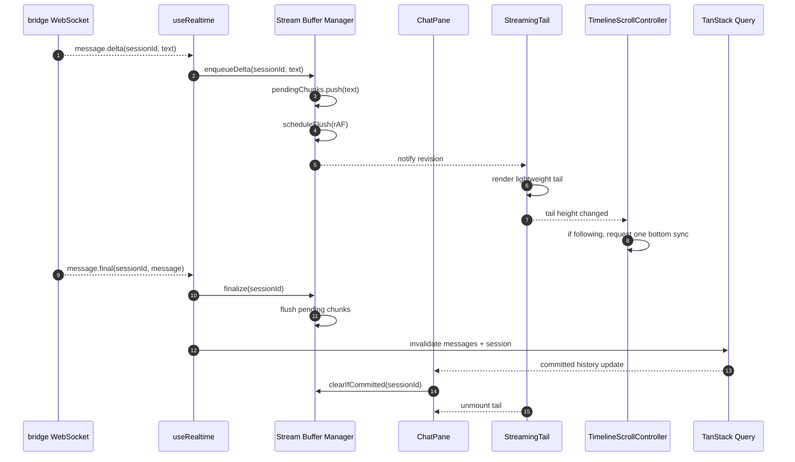

# Streaming Rendering Optimization Design

## 1. 目的

本書は、assistant の streaming 表示中に発生している
描画負荷、スクロールの引っ張られ、セッション切り替え遅延を
根本から解消するための設計方針を定義する。

対象は `apps/web` の frontend であり、
特に以下の hot path を再設計する。

- WebSocket `message.delta` の受信
- streaming text の保持と描画
- live activity の更新
- timeline auto-follow
- thread 切り替えと new session 遷移

本書は「現状の実装を局所修正する」のではなく、
streaming 描画を app-wide render path から切り離す前提で整理する。

## 2. 背景

現状の streaming は概ね以下の流れになっている。

- `useRealtime()` が WebSocket `message.delta` を受信する
- Zustand `streaming[sessionId]` に文字列連結で追記する
- `App` が selected session 相当の `streamingText` を root で購読する
- `ChatPane` が delta ごとに再描画される
- `ConversationTimeline` が再構築される
- `scrollIntoView()` がほぼ毎 delta 実行される
- streaming bubble は毎回 `ReactMarkdown` と `remend` を通る

この構成では、streaming が始まると
chat 末尾だけではなく app 全体が高頻度更新の影響を受ける。

結果として、以下が起きやすい。

- sidebar の click が遅れる
- new session 遷移が詰まる
- user が上へ scroll しても下へ引っ張られる
- token 数が増えるほど 1 delta あたりの render cost が増える

## 3. 現状のボトルネック

### 3.1 Root-level subscription

`App` が selected session の `streamingText` と `activities` を直接購読している。

このため、delta 1 件ごとに少なくとも以下が巻き込まれる。

- route 由来の派生 state
- sidebar view state の導出
- repo grouping / session row 描画
- chat view state の再構築

streaming の hot path は chat pane の末尾だけで閉じるべきであり、
app shell や sidebar を巻き込むべきではない。

### 3.2 String append on every delta

`streaming[sessionId] = previous + delta` のような文字列連結は、
文字列が伸びるほどコストが増える。

delta ごとに新しい全文字列を生成すると、
streaming が長引くほど GC とコピーコストが増える。

### 3.3 Full markdown parse on every delta

streaming bubble は未完成 markdown に対して
`remend()` と `ReactMarkdown` を毎回通している。

これは以下の意味で hot path に不向きである。

- 解析コストが全文長に比例する
- code block / link / table などで subtree が重くなりやすい
- token ごとの差分描画ではなく全文再解釈になる

### 3.4 Auto-follow on every update

`streamingText`, `messages`, `liveActivities`, `showPendingAssistant` の変化ごとに
auto-follow effect が発火している。

そのため、user が scroll しようとしている最中でも
programmatic scroll が高頻度で差し込まれやすい。

### 3.5 Scroll ownership が複雑

desktop と mobile で scroll owner が異なり、
mobile では root scroll と sticky composer の組み合わせになっている。

この構成自体は product requirement として成立しうるが、
streaming 側は「scroll owner を毎 frame 1 回だけ制御する」前提で書かれていない。

### 3.6 Session switch と stream task の切断が弱い

selected session が変わっても、
旧 session にぶら下がった flush task, scroll task, render task が
明示的な phase を持たずに走り続けやすい。

このため、thread switch の user intent が
streaming 中の更新に押し負ける余地がある。

## 4. 目標

本設計の目標は以下。

- streaming 中でも thread switch と new session が即時反応する
- sidebar は selected thread の delta ごとに rerender しない
- auto-follow は user が最下部にいる時だけ動く
- user が上へ scroll したら follow は即停止する
- streaming の hot path は history 全体のサイズに影響されにくい
- final message は正式履歴へ flicker なく置き換わる

定量目標の目安:

- `message.delta` が 20-60Hz 相当で来ても UI が入力不能にならない
- selected thread 以外の view は delta ごとに rerender しない
- auto-follow は最大でも 1 animation frame に 1 回
- final commit 前の hot path で full markdown parse を行わない

## 5. 非目標

以下は本書の直接の対象外とする。

- backend event schema の変更
- `message.final` の意味論変更
- session list polling 戦略の全面刷新
- markdown renderer 全体の差し替え
- mobile layout policy 自体の最終決定

ただし、frontend の責務分離のために
component 構造や store 境界を変えることは対象に含む。

## 6. 設計原則

### 6.1 Streaming hot path を app shell から隔離する

streaming は chat tail 専用の concern として扱う。

- `App` は streaming text を購読しない
- `SidebarPane` は streaming delta を知らない
- selected thread の tail component だけが高頻度更新を受ける

### 6.2 受信頻度と描画頻度を分離する

WebSocket 受信をそのまま React render 頻度にしない。

- 受信は即時
- UI commit は frame 単位または短い batch 単位

### 6.3 Canonical history と temporary tail を分離する

正式履歴は React Query の `messages` で持ち、
streaming 中の assistant 末尾は別レイヤで扱う。

- committed history
- temporary streaming tail
- finalization handoff

を明示的に分ける。

### 6.4 Scroll は state machine として扱う

scroll は「たまたま effect が走ったら追従する」ではなく、
明示的な mode を持たせる。

推奨 mode:

- `following`
- `detached`
- `jump_requested`
- `suspended`

### 6.5 Session switch は最優先

thread 切り替えや new session は
streaming update より優先されるべき user intent とみなす。

そのため、session 切り替え時は旧 session の一時 task を即停止する。

## 7. 推奨アーキテクチャ

### 7.1 レイヤ構成

新しい streaming path は以下の 4 層に分ける。

### Layer A: Transport Ingestion

WebSocket event を受け取る層。

責務:

- event を parse する
- session ごとの stream buffer へ delta を enqueue する
- terminal event を buffer manager に伝える

ここでは React render を発生させない。

### Layer B: Stream Buffer Manager

session 単位の mutable buffer を管理する層。

責務:

- chunk の一時蓄積
- flush schedule
- revision 発行
- finalization
- session switch 時の task cancel

この層は React component tree 外の lightweight state とする。

候補:

- Zustand vanilla store
- plain TypeScript class + `useSyncExternalStore`

推奨は `useSyncExternalStore` に乗る小さな専用 store である。

### Layer C: Streaming Presentation

selected session の tail だけを描画する層。

責務:

- current session の stream snapshot を購読する
- lightweight tail を表示する
- optional な idle/final markdown render を切り替える

### Layer D: Committed History

正式履歴の描画。

責務:

- `messagesQuery` の結果を描画する
- `message.final` 後の invalidate/refetch を受ける
- streaming tail と重複しないよう handoff する

### 7.2 Component 責務の再編

推奨する component 分離は以下。

- `App`
  - route, query, layout のみ担当
  - streaming text を購読しない
- `ChatPane`
  - detail, messages, action handlers を受ける
  - hot path の local coordinator になる
- `ConversationHistory`
  - committed history だけ描画
- `StreamingTail`
  - selected session の streaming snapshot だけ購読
- `TimelineScrollController`
  - scroll follow state machine を担当

この分離により、
history subtree と streaming subtree の invalidation を分けられる。

### 7.3 新規モジュール案

候補ファイル:

- `apps/web/src/features/chat/stream-store.ts`
- `apps/web/src/features/chat/use-session-stream.ts`
- `apps/web/src/features/chat/StreamingTail.tsx`
- `apps/web/src/features/chat/TimelineScrollController.ts`

既存ファイルの責務変更:

- `apps/web/src/hooks/use-realtime.ts`
  - delta の直接 append をやめる
- `apps/web/src/store/ui-store.ts`
  - `streaming` と `activities` を app-wide store から外すか cold state 化する
- `apps/web/src/app/App.tsx`
  - root-level streaming subscription を削除する
- `apps/web/src/features/chat/ChatPane.tsx`
  - timeline, stream tail, scroll control を分離する

## 8. Stream Buffer Manager の提案

### 8.1 管理単位

buffer は session ごとに持つ。

```ts
type SessionStreamSnapshot = {
  sessionId: string;
  phase: "idle" | "streaming" | "finalizing";
  committedText: string;
  revision: number;
  lastUpdatedAt: number;
};

type SessionStreamMutableState = {
  snapshot: SessionStreamSnapshot;
  pendingChunks: string[];
  flushRafId: number | null;
  finalizeTimerId: number | null;
};
```

### 8.2 データモデルの考え方

- `pendingChunks`
  - 受信した delta をそのまま積む
- `committedText`
  - UI が読む text
- `revision`
  - snapshot 更新のたびに increment

重要なのは、delta ごとに `committedText = committedText + delta` を
無制限に同期実行しないことである。

### 8.3 Flush 方式

推奨は `requestAnimationFrame` 単位の flush。

- delta 受信
  - `pendingChunks.push(delta)`
- flush 未予約なら `requestAnimationFrame(flush)`
- flush 時
  - `pendingChunks.join("")`
  - `committedText` に 1 回だけ反映
  - `revision++`
  - listeners 通知

これにより、受信頻度と render 頻度が分離される。

### 8.4 Finalize 方式

`message.final` 受信時は以下の順で処理する。

1. pending chunk を即 flush
2. phase を `finalizing` にする
3. `messagesQuery` invalidate を走らせる
4. 正式履歴に assistant message が現れたら stream snapshot を clear する

ここでは timing race を防ぐため、
`message.final` を受けた瞬間に見た目を消さない。

## 9. Rendering Strategy

### 9.1 Streaming 中は lightweight tail を使う

streaming 中の tail は
常に full markdown である必要はない。

推奨方針:

- hot path では plain text または very-light markdown にする
- finalization 後に正式履歴で full markdown を表示する

最も安全な初期案:

- streaming 中は `white-space: pre-wrap` ベースの plain text
- code fence と link の完全解釈は final 後

これで hot path から `remend()` と `ReactMarkdown` を外せる。

### 9.2 Optional idle upgrade

必要なら、stream が少し止まった時だけ
軽い debounce を挟んで markdown 表示へ upgrade する。

例:

- 120ms 以上 delta が来なければ markdown render
- 次の delta が来たら plain text mode に戻す

ただし初期実装では複雑さを避け、
final までは plain text 固定でよい。

### 9.3 History subtree を安定化する

history list は streaming に引きずられて再構築されてはならない。

対策:

- `ConversationHistory` は `messages` だけを props に持つ
- `StreamingTail` は別 component に分離する
- `buildTimelineEntries(messages)` は history 側だけで計算する

これにより、committed history の render cost を
delta ごとに払わずに済む。

## 10. Scroll Controller Design

### 10.1 Scroll contract

scroll controller が知るべきことは以下だけに絞る。

- 現在 pinned to bottom か
- user initiated detach が起きたか
- 新しい streaming update が来たか
- jump to latest が要求されたか

### 10.2 Follow の条件

auto-follow は以下を全部満たす時だけ実行する。

- current mode が `following`
- 最新 update が selected session のもの
- scroll owner が有効
- その frame で未実行

### 10.3 Detach の条件

以下のいずれかで `detached` に入る。

- user wheel up
- user touch move up
- pinned threshold を超えて bottom から離れた

`detached` 中は delta が来ても scroll を動かさない。

### 10.4 Jump の条件

user が `Latest` を押した時だけ
`jump_requested` に入り、1 回だけ bottom へ移動する。

移動完了後に `following` へ戻す。

### 10.5 Scroll owner abstraction

scroll owner が root か internal timeline かは
controller の外で解決する。

```ts
type ScrollOwner = {
  readScrollTop(): number;
  scrollToBottom(): void;
  isNearBottom(): boolean;
  subscribe(listener: () => void): () => void;
};
```

これにより、mobile policy を変えても
follow state machine 自体は流用できる。

## 11. Navigation Responsiveness

### 11.1 App から hot subscription を外す

最重要の改善はこれである。

`App` は以下のみ持つ。

- selected session route
- React Query data
- optimistic entity state
- layout state

selected thread の streaming delta は
`ChatPane` 以下だけに閉じ込める。

### 11.2 Session switch 時の cancel

selected session が変わったら旧 session に対して以下を止める。

- pending flush RAF
- idle markdown timer
- scroll follow task
- stale subscription

session switch の結果として新しい `StreamingTail` が mount され、
旧 tail は unmount される構造にする。

### 11.3 Urgent と non-urgent の分離

必要なら React 19 の `startTransition` を使い、
非緊急な派生更新を遅延可能にする。

ただし、navigation 自体は同期に保つ。

使いどころの候補:

- session list の background refresh indicator
- non-critical debug visualization
- final history invalidate の副次的再描画

## 12. Live Activities の扱い

`activities` も streaming と同じく hot path である。

したがって方針は streaming text と揃える。

- app-wide Zustand の root subscription から外す
- selected session の activity tray だけが購読する
- output append は batch する

stream text と activity を別 store にするか、
同じ hot store 内で別 channel に分けるかは実装時に選べる。

初期案としては同一 store 内の別 map で十分である。

## 13. Event Flow



## 14. 段階的な移行計画

### Phase 1: Subscription Isolation

目的:

- `App` から `streamingText` / `activities` 購読を外す
- chat subtree のみ高頻度更新にする

変更:

- `App` の selector を削除
- `ChatPane` か `StreamingTail` に selected session 直読 hook を追加

期待効果:

- sidebar click latency が大きく下がる
- thread switch が stream 中でも通りやすくなる

### Phase 2: Buffer Batching

目的:

- delta ごとの synchronous string append を廃止する

変更:

- stream buffer manager 導入
- `requestAnimationFrame` flush 導入

期待効果:

- CPU 使用率低下
- GC 圧縮
- render 回数の上限化

### Phase 3: Lightweight Streaming Tail

目的:

- hot path から markdown parse を外す

変更:

- streaming 中は plain text tail を採用
- final commit 後に正式 markdown に handoff

期待効果:

- 長文 stream での後半劣化を抑制

### Phase 4: Scroll Controller Rewrite

目的:

- pull-down / thread switch 中の不自然な scroll を除去する

変更:

- follow state machine 導入
- 1 frame 1 scroll 制御
- detach / jump contract 明確化

期待効果:

- 下への引っ張られ解消
- user scroll 優先の挙動になる

### Phase 5: Instrumentation

目的:

- 退行を見える化する

変更:

- DEV 向け metrics
- render count / flush count / scroll count の計測

## 15. 計測項目

最低限計測したいもの:

- `message.delta` 受信回数
- stream flush 回数
- selected `StreamingTail` render 回数
- sidebar render 回数
- auto-follow 実行回数
- detached 中の suppressed follow 回数
- thread switch 開始から first paint までの時間

DEV では `console.info` でも十分だが、
最終的には `performance.mark()` / `performance.measure()` の方がよい。

## 16. テスト計画

本件は hot path の最適化であり、
機能の正しさだけでなく「退行しないこと」を継続的に確認する必要がある。

### 16.1 Unit Test

対象:

- session selector helper
- stream buffer manager
- flush scheduling
- finalize handoff 条件
- scroll mode 判定ロジック

最低限固定したいこと:

- selected session の streaming text を正しく拾う
- delta が frame 単位で batch される
- clear / finalize 時に stale chunk が再出現しない
- detached 中は follow が再開しない

### 16.2 Integration Test

対象:

- `useRealtime` から hot store への受け渡し
- `ChatPane` / `StreamingTail` / committed history の handoff
- thread switch 中の旧 session task cancel
- `message.final` 後の invalidate と tail clear

最低限固定したいこと:

- stream 中に selected thread を切り替えても旧 tail が新 pane に残らない
- final message が正式履歴へ置き換わる時に bubble が消えない
- sidebar は streaming delta で不要に rerender しない

### 16.3 Interaction Test

ブラウザ上で確認したい項目:

- stream 中に sidebar row を押して即 route が切り替わる
- stream 中に `+ New session` を押して即 draft へ遷移する
- user が上に scroll した後は auto-follow が止まる
- `Latest` を押した時だけ jump が起きる
- mobile と desktop で scroll owner ごとの挙動が破綻しない

### 16.4 Regression Watch

DEV では以下を見える化しておく。

- stream flush 回数
- `StreamingTail` render 回数
- sidebar render 回数
- auto-follow 実行回数
- thread switch latency

最適化実装後は、
不具合修正ごとにこのメトリクスが悪化していないかを確認する。

## 17. 受け入れ条件

以下を満たせば成功とみなす。

- streaming 中に sidebar row を押すと即座に route が切り替わる
- streaming 中に `+ New session` を押すと即座に draft session へ遷移する
- user が上へ scroll した後、delta が続いても勝手に bottom へ戻らない
- `Latest` を押した時だけ bottom へ戻る
- selected thread の stream 中でも sidebar 全体は delta ごとに rerender しない
- final message 到着時に streaming tail から正式履歴へ自然に置き換わる

## 18. リスクとトレードオフ

### 18.1 Streaming 中の見た目差分

plain text tail を採用すると、
final markdown と完全一致しない時間帯が生まれる。

これは性能優先の意図的 tradeoff である。

### 18.2 Handoff race

`message.final` より先に query refresh が遅れると、
tail を早く消しすぎた場合に assistant bubble が一瞬消える。

したがって clear 条件は
「final を受けた」ではなく
「committed history に反映された」寄りに設計する必要がある。

### 18.3 Store 境界の複雑化

app-wide store と hot store を分けると、
設計は明快になる一方で file 数は増える。

ただし streaming のような高頻度処理では、
責務分離の利益が上回る。

## 19. 実装開始時の推奨順

実装順は以下を推奨する。

1. `App` の hot subscription を外す
2. `StreamingTail` を分離する
3. stream buffer manager を導入する
4. streaming 中の markdown を止める
5. scroll controller を rewrite する
6. metrics を追加する

この順なら、効果の大きい部分から安全に差し替えられる。

## 20. ADR 化について

この文書は implementation guide として始めるが、
実装完了後は current behavior と採用理由を反映した ADR として
ブラッシュアップする。

その際に追記するもの:

- 最終的に採用した store 境界
- scroll owner policy の確定内容
- markdown hot path の最終方針
- 実測で得られた効果
- 採用しなかった代替案と理由

要するに、本書は実装前の設計メモで終わらせず、
実装後に architecture decision record へ昇格させる前提で運用する。

## 21. 結論

今回の問題は、個別の scroll bug ではなく、
streaming が app-wide render path に直結していることが根本原因である。

したがって最適化の中心は
「delta ごとの再描画を速くする」ことではなく、
「delta ごとの再描画が起きる範囲を chat tail だけに限定する」ことにある。

以後の実装は、

- hot path isolation
- buffered commit
- lightweight streaming tail
- explicit scroll state machine

の 4 本柱で進める。
